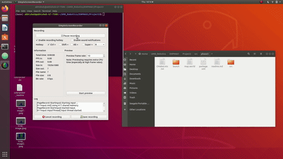

# Astar Gazebo Simulation 
[](https://opensource.org/licenses/MIT) 
---
This project simulates using OpenCV as well as Gazebo, the searching and the path obtained by A* algorithm for a rigid robot in a map with obstacles.

## Result:



## Instructions
1) Clone the repository using
```
git clone https://github.com/Abhishek-Nalawade/Astar-gazebo-simulation
```
2) Please overlay your turtlebot3 package first (Instructions given below for overlaying)
3) ```Create a ROS package with name "phase3"``` and paste all the files from the cloned folder inside the /package_name folder
4) Type ```catkin_make``` and then next type ```source devel/setup.bash```
5) Run the code using the command
6) Note: The orientation is to be entered in radians
```
roslaunch <package_name> astar_planning.launch x_pos:=3 y_pos:=0 start_orientation:=0 x_goal_pos:=0 y_goal_pos:=3 goal_orientation:=0
```
7) To run the program with default arguments (default x_pos:=3 y_pos:=0 start_orientation:=0 x_goal_pos:=0 y_goal_pos:=3 goal_orientation:=0)
```
roslaunch <package_name> astar_planning.launch
```
8) After launching a window will pop-up showing the map using OpenCV visualization, then hit any key on the on that window to begin the simulations.

## Instructions - Overlaying Turtlebot package
Overlaying can be useful when two or more packages are needed to run from your project package.
1) In terminal navigate to turtlebot3 ros packages and type ```source devel/setup.bash```
2) Navigate to your project_workspace and delete any previous devel and build files and type ```catkin_make```
3) Now again type ```source devel/setup.bash```

## General steps to set up a ROS project
1) Create the workspace and source folder with command ```mkdir -p ws_name/src```
2) Go in src and type command ```catkin_init_workspace```
3) In folder ws_name type command ```catkin_make```
4) Go in src and type ```catkin_create_pkg pakage_name rospy std_msgs (other dependencies)```
5) Go back in ws_name again and type ```catkin_make```
6) Navigate to src/package_name/src/ and create the talker and subscriber
7) In package_name create the launch folder and inside that create the launch file
8)To run a ros project in ws_name type catkin_make first then source devel/setup.bash and then roslaunch <name_of_package> <name_of_launch_file>

## Project Requirements
ROS Melodic\
Turtlebot 3 \
For Astar planning:\
Python 3.7\
OpenCV
